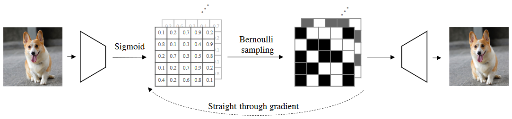
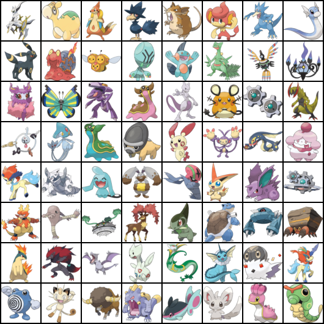
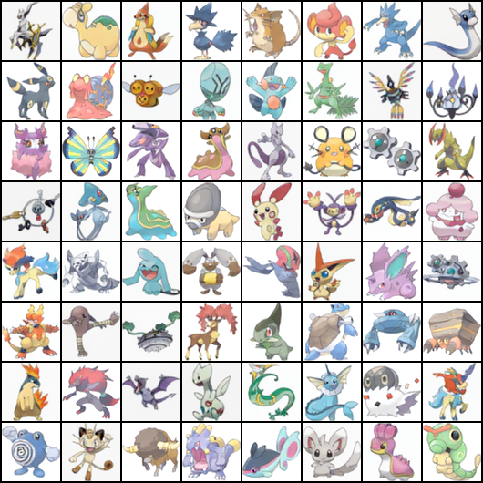

# Binary Latent Diffusion
Implementation of [Binary Latent Diffusion](https://arxiv.org/abs/2304.04820).

```shell
pip install datasets lossers==0.0.6
```

| input image | reconstruction | iterations | loss |
| :---------: | :------------: | :--------: | :--: |
|  |  | 017000 | LPIPS |
